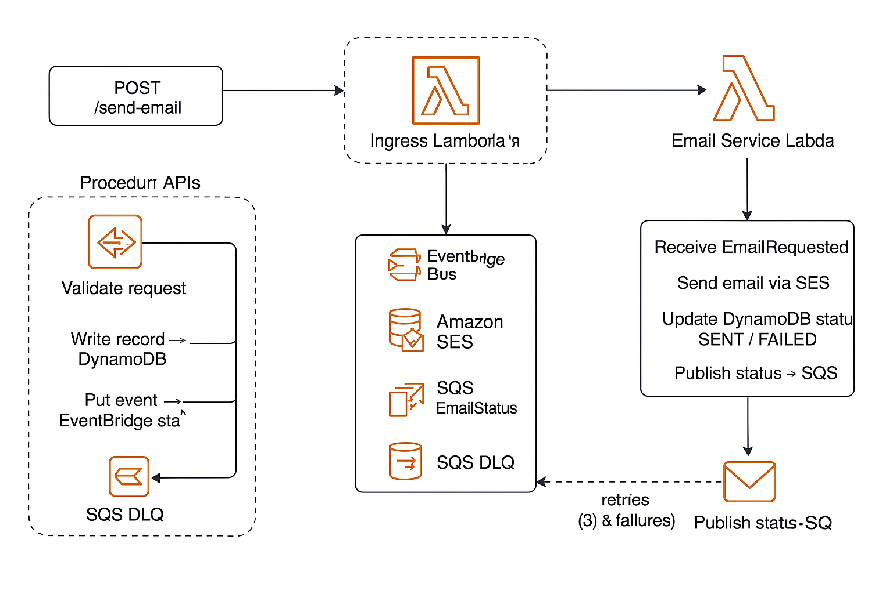

<style>
section {
  overflow: hidden;
  padding: 1.5rem;
}

section.smaller {
  padding: 1rem;
}

section.smaller h2 {
  font-size: 1.8rem;
  margin-bottom: 0.8rem;
}

section.smaller table {
  margin: 0;
}
</style>

# Event-Driven Monitoring & DevOps Automation

### _AWS CDK + GitHub Actions + Shift-Left Observability_

---

<!-- _class: invert -->

## System Architecture Overview

<div style="display: grid; grid-template-columns: 1fr 1fr; gap: 1.5rem; font-size: 0.9em;">

<div>
<h3 style="color: #58a6ff; font-size: 0.8rem; margin: 0 0 0.2rem 0;">System Design</h3>

<div style="position: relative;">
  
</div>

<style>
  .diagram-zoomed {
    position: fixed !important;
    top: 50% !important;
    left: 50% !important;
    transform: translate(-50%, -50%) !important;
    width: 90vw !important;
    height: auto !important;
    max-height: 90vh !important;
    z-index: 9999 !important;
    background: white !important;
    box-shadow: 0 0 50px rgba(0,0,0,0.8) !important;
    border-radius: 8px !important;
    padding: 20px !important;
  }
  
  .diagram-overlay {
    position: fixed;
    top: 0;
    left: 0;
    width: 100vw;
    height: 100vh;
    background: rgba(0,0,0,0.8);
    z-index: 9998;
  }
</style>

<script>
let isZoomed = false;

function toggleDiagramZoom(img) {
  if (isZoomed) {
    // Close zoom
    img.classList.remove('diagram-zoomed');
    const overlay = document.querySelector('.diagram-overlay');
    if (overlay) {
      overlay.remove();
    }
    img.onclick = function() { toggleDiagramZoom(img); };
    isZoomed = false;
  } else {
    // Open zoom
    const overlay = document.createElement('div');
    overlay.className = 'diagram-overlay';
    document.body.appendChild(overlay);
    img.classList.add('diagram-zoomed');
    
    // Set up close handlers
    overlay.onclick = function() { toggleDiagramZoom(img); };
    img.onclick = function(e) { 
      e.preventDefault();
      e.stopPropagation();
      toggleDiagramZoom(img); 
    };
    
    isZoomed = true;
  }
}
</script>

<h3 style="color: #58a6ff; font-size: 0.8rem; margin: 1rem 0 0.5rem 0;">Key Components</h3>

- **RestApi** (`aws-apigateway`) - HTTP endpoint with CORS
- **Function** (`aws-lambda`) - Node.js runtime with layers
- **Table** (`aws-dynamodb`) - On-demand billing, GSI
- **EventBus** (`aws-events`) - Custom event patterns
- **EmailIdentity** (`aws-sesv2`) - Domain verification
- **Queue + DeadLetterQueue** (`aws-sqs`) - FIFO ordering

<div style="margin-top: 0.3rem;">
  <a href="./code/cdk-system-components.html" style="padding: 2px 4px; border: 1px solid #58a6ff; border-radius: 2px; text-decoration: none; color: #58a6ff; background: rgba(88,166,255,0.1); font-size: 0.45em;">View System Components IaC</a>
</div>

<!-- Pipeline Diagram moved from Dev & Deploy section -->
<div style="margin-top: 0.1rem; padding: 0.4rem; background: rgba(56,189,248,0.05); border-radius: 6px; border: 1px solid rgba(56,189,248,0.2);">
  <div style="font-size: 0.3em; color: #38bdf8; font-weight: bold; margin-bottom: 0.4rem; text-align: center;">🔄 Complete Development Pipeline</div>
  
  <!-- PR Phase -->
  <div style="background: rgba(255,149,0,0.1); border-radius: 4px; padding: 0.3rem; margin-bottom: 0.4rem;">
    <div style="color: #ff9500; font-weight: bold; font-size: 0.25em; margin-bottom: 0.3rem;">PR Phase - Early Quality Gates</div>
    <div style="font-size: 0.22em; line-height: 1.2; display: flex; justify-content: space-between; align-items: center;">
      <div style="text-align: center; flex: 1;">
        <div style="background: #ff9500; color: white; padding: 0.15rem 0.3rem; border-radius: 3px; margin-bottom: 0.2rem; font-size: 0.9em;">🔄 PR</div>
        <div style="color: #7d8590; font-size: 0.8em;">Branch Push</div>
      </div>
      <div style="color: #ff9500; font-weight: bold; font-size: 0.8em;">→</div>
      <div style="text-align: center; flex: 1;">
        <div style="background: #1f6feb; color: white; padding: 0.15rem 0.3rem; border-radius: 3px; margin-bottom: 0.2rem; font-size: 0.9em;">🔒 Security</div>
        <div style="color: #7d8590; font-size: 0.8em;">SAST + Deps</div>
      </div>
      <div style="color: #ff9500; font-weight: bold; font-size: 0.8em;">→</div>
      <div style="text-align: center; flex: 1;">
        <div style="background: #22c55e; color: white; padding: 0.15rem 0.3rem; border-radius: 3px; margin-bottom: 0.2rem; font-size: 0.9em;">✅ Tests</div>
        <div style="color: #7d8590; font-size: 0.8em;">Unit + Lint</div>
      </div>
      <div style="color: #ff9500; font-weight: bold; font-size: 0.8em;">→</div>
      <div style="text-align: center; flex: 1;">
        <div style="background: #a855f7; color: white; padding: 0.15rem 0.3rem; border-radius: 3px; margin-bottom: 0.2rem; font-size: 0.9em;">📋 Review</div>
        <div style="color: #7d8590; font-size: 0.8em;">Peer + Policy</div>
      </div>
    </div>
  </div>
  
  <div style="text-align: center; color: #22c55e; font-weight: bold; font-size: 0.25em; margin: 0.3rem 0;">✅ All Gates Pass → Merge Approved</div>
  
  <!-- Post-Merge Phase -->
  <div style="background: rgba(34,197,94,0.1); border-radius: 4px; padding: 0.3rem;">
    <div style="color: #22c55e; font-weight: bold; font-size: 0.25em; margin-bottom: 0.3rem;">Deployment Phase - Automated Release</div>
    <div style="font-size: 0.22em; line-height: 1.2; display: flex; justify-content: space-between; align-items: center;">
      <div style="text-align: center; flex: 1;">
        <div style="background: #22c55e; color: white; padding: 0.15rem 0.3rem; border-radius: 3px; margin-bottom: 0.2rem; font-size: 0.9em;">🚀 Deploy</div>
        <div style="color: #7d8590; font-size: 0.8em;">CDK Stack</div>
      </div>
      <div style="color: #22c55e; font-weight: bold; font-size: 0.8em;">→</div>
      <div style="text-align: center; flex: 1;">
        <div style="background: #7c3aed; color: white; padding: 0.15rem 0.3rem; border-radius: 3px; margin-bottom: 0.2rem; font-size: 0.9em;">🧪 E2E</div>
        <div style="color: #7d8590; font-size: 0.8em;">Integration</div>
      </div>
      <div style="color: #22c55e; font-weight: bold; font-size: 0.8em;">→</div>
      <div style="text-align: center; flex: 1;">
        <div style="background: #da3633; color: white; padding: 0.15rem 0.3rem; border-radius: 3px; margin-bottom: 0.2rem; font-size: 0.9em;">📊 Monitor</div>
        <div style="color: #7d8590; font-size: 0.8em;">Observability</div>
      </div>
    </div>
  </div>
</div>

</div>

<div>
<h3 style="color: #58a6ff; font-size: 0.8rem; margin: 0 0 0.5rem 0;">Shift-Left Deployment Flow</h3>

<div style="font-size: 0.35em; line-height: 1.3;">

<!-- PR Phase -->
<div style="background: rgba(255,149,0,0.08); border: 1px solid rgba(255,149,0,0.2); border-radius: 4px; padding: 0.4rem; margin: 0.3rem 0;">
  <div style="color: #ff9500; font-weight: bold; margin-bottom: 0.3rem; font-size: 1.1em;">🔄 Pull Request Phase (Shift-Left)</div>
  
  <div style="display: flex; align-items: center; margin: 0.2rem 0; padding: 0.15rem; background: rgba(255,149,0,0.1); border-radius: 3px;">
    <span style="background: #ff9500; color: white; padding: 0.15rem 0.3rem; border-radius: 2px; margin-right: 0.4rem; font-weight: bold; font-size: 0.9em;">PR</span>
    <span><strong>Create PR</strong> → Automated checks trigger immediately</span>
  </div>
  
  <div style="display: grid; grid-template-columns: 1fr 1fr; gap: 0.3rem; margin: 0.3rem 0;">
    <div style="background: rgba(31,111,235,0.1); padding: 0.2rem; border-radius: 2px; border-left: 2px solid #1f6feb;">
      <strong style="color: #1f6feb;">Security Scans</strong><br/>
      <span style="font-size: 0.9em; color: #7d8590;">SAST, dependency scan, secrets detection</span>
    </div>
    <div style="background: rgba(124,58,237,0.1); padding: 0.2rem; border-radius: 2px; border-left: 2px solid #7c3aed;">
      <strong style="color: #7c3aed;">Code Quality</strong><br/>
      <span style="font-size: 0.9em; color: #7d8590;">Linting, formatting, complexity</span>
    </div>
    <div style="background: rgba(34,197,94,0.1); padding: 0.2rem; border-radius: 2px; border-left: 2px solid #22c55e;">
      <strong style="color: #22c55e;">Unit Tests</strong><br/>
      <span style="font-size: 0.9em; color: #7d8590;">Coverage >80%, mocked dependencies</span>
    </div>
    <div style="background: rgba(168,85,247,0.1); padding: 0.2rem; border-radius: 2px; border-left: 2px solid #a855f7;">
      <strong style="color: #a855f7;">CDK Validation</strong><br/>
      <span style="font-size: 0.9em; color: #7d8590;">Synth, diff, policy checks</span>
    </div>
  </div>
</div>

<div style="text-align: center; color: #22c55e; margin: 0.2rem 0; font-weight: bold;">✅ All checks pass → Ready for merge</div>

<!-- Post-Merge Phase -->
<div style="background: rgba(34,197,94,0.08); border: 1px solid rgba(34,197,94,0.2); border-radius: 4px; padding: 0.4rem; margin: 0.3rem 0;">
  <div style="color: #22c55e; font-weight: bold; margin-bottom: 0.3rem; font-size: 1.1em;">🚀 Post-Merge Deployment</div>

  <div style="display: flex; align-items: center; margin: 0.2rem 0; padding: 0.15rem; background: rgba(34,197,94,0.1); border-radius: 3px;">
    <span style="background: #22c55e; color: white; padding: 0.15rem 0.3rem; border-radius: 2px; margin-right: 0.4rem; font-weight: bold; font-size: 0.9em;">1</span>
    <span><strong>Merge to Main</strong> → Triggers production deployment</span>
  </div>

  <div style="display: flex; align-items: center; margin: 0.2rem 0; padding: 0.15rem; background: rgba(34,197,94,0.1); border-radius: 3px;">
    <span style="background: #1f6feb; color: white; padding: 0.15rem 0.3rem; border-radius: 2px; margin-right: 0.4rem; font-weight: bold; font-size: 0.9em;">2</span>
    <span><strong>CDK Deploy</strong> → Creates/Updates AWS resources</span>
  </div>

  <div style="display: flex; align-items: center; margin: 0.2rem 0; padding: 0.15rem; background: rgba(34,197,94,0.1); border-radius: 3px;">
    <span style="background: #7c3aed; color: white; padding: 0.15rem 0.3rem; border-radius: 2px; margin-right: 0.4rem; font-weight: bold; font-size: 0.9em;">3</span>
    <span><strong>Integration Tests</strong> → End-to-end validation</span>
  </div>
</div>

<div style="margin-top: 0.8rem; padding: 0.3rem; border-left: 3px solid #ff9500; background: rgba(255,149,0,0.05);">
  <strong style="color: #ff9500;">Shift-Left Benefits:</strong> Early feedback, reduced deployment risk, faster fixes, quality gates
</div>

<!-- Key Metrics & Success Indicators -->
<div style="margin-top: 0.8rem; padding: 0.4rem; background: rgba(34,197,94,0.08); border-radius: 4px; border: 1px solid rgba(34,197,94,0.2);">
  <div style="color: #22c55e; font-weight: bold; margin-bottom: 0.3rem; font-size: 1em;">📊 Key Success Metrics</div>
  <div style="display: grid; grid-template-columns: 1fr 1fr; gap: 0.3rem; font-size: 0.8em; line-height: 1.2;">
    <div style="padding: 0.2rem; background: rgba(34,197,94,0.1); border-radius: 2px;">
      <strong style="color: #22c55e;">PR Cycle Time:</strong><br/>
      <span style="color: #7d8590; font-size: 0.9em;">Target: <60min validation</span>
    </div>
    <div style="padding: 0.2rem; background: rgba(34,197,94,0.1); border-radius: 2px;">
      <strong style="color: #22c55e;">Deployment Frequency:</strong><br/>
      <span style="color: #7d8590; font-size: 0.9em;">Target: Multiple/day</span>
    </div>
    <div style="padding: 0.2rem; background: rgba(34,197,94,0.1); border-radius: 2px;">
      <strong style="color: #22c55e;">Lead Time:</strong><br/>
      <span style="color: #7d8590; font-size: 0.9em;">Code to prod <4hr</span>
    </div>
    <div style="padding: 0.2rem; background: rgba(34,197,94,0.1); border-radius: 2px;">
      <strong style="color: #22c55e;">Change Failure Rate:</strong><br/>
      <span style="color: #7d8590; font-size: 0.9em;">Target: <2%</span>
    </div>
  </div>
</div>

<p style="font-size: 0.84rem; color: #8b949e; font-style: italic; margin: 0.8rem 0 0.2rem 0;">*All infrastructure is version-controlled, peer-reviewed, and deployed through CI/CD pipelines*</p>

</div>
</div>

</div>

<style scoped>
h2 {
  font-size: 1.8rem;
  margin-bottom: 0.2rem;
}

h3 {
  font-size: 0.8rem;
  color: #58a6ff;
  margin: 0.1rem 0 0.05rem 0;
}

ul {
  font-size: 0.42rem;
  line-height: 1.1;
  margin: 0.05rem 0 0.1rem 0;
  padding-left: 0.8rem;
}

ul li {
  margin: 0.05rem 0;
}

img {
  max-width: 40%;
  max-height: 25vh;
  height: auto;
  margin: 0.1rem auto 0.1rem auto;
  display: block;
  border-radius: 6px;
  border: 1px solid rgba(88,166,255,0.2);
  box-shadow: 0 2px 6px rgba(0,0,0,0.3);
}
</style>

---

<!-- _class: invert smaller -->

## 📡 Monitoring & Observability

<div style="font-size:0.315em;">

| **Component** | **What to Monitor**        | **Failure Indicators**          | **Detection / Metric**                                     | **Alert Trigger**                  | **Resolution**                                       |
| ------------- | -------------------------- | ------------------------------- | ---------------------------------------------------------- | ---------------------------------- | ---------------------------------------------------- |
| API / Lambda  | Request failures / latency | 5XX, throttles, errors          | CloudWatch `Errors`, `Throttles`, `Latency` (p95)          | >1% 5XX in 5m or >3 errors         | Inspect logs; rollback/fix config; raise concurrency |
| EventBridge   | Delivery to targets        | `FailedInvocations`             | CloudWatch metric `FailedInvocations`; DLQ depth           | >0 failures or DLQ >0              | Fix target IAM/endpoint; redrive DLQ                 |
| Email Lambda  | Send processing            | SES API errors, timeouts        | Lambda `Errors`, `Duration`; custom `emailSendFailures`    | >0 errors                          | Tune retries; handle throttling; fix code            |
| SES           | Reputation / quota         | Bounce↑, Complaint↑, Throttled  | SES `Reputation.BounceRate`, `ComplaintRate`, `Reject`     | >2% / >0.1% or Throttled>0         | Clean list; slow rate; request quota                 |
| DynamoDB      | Persistence & status       | Throttled writes; stuck PENDING | `ThrottledRequests`; custom “pending_age”                  | Throttled>0 or pending>N for X min | On-demand/RCU+; reprocess stale                      |
| SQS (Status)  | Backlog & failures         | Visible↑; DLQ↑; oldest age↑     | `ApproximateNumberOfMessagesVisible`, `AgeOfOldestMessage` | Visible>100 or DLQ>0               | Scale consumers; redrive DLQ                         |

</div>

<div style="margin-top: 2rem; display: grid; grid-template-columns: 1fr 1fr; gap: 1.5rem;">

<div>
<h3 style="font-size: 50%;">📈 Success Metrics</h3>

<div style="font-size:0.364em;">

| **KPI**             | **Definition**                    | **Purpose**           | **Target** |
| ------------------- | --------------------------------- | --------------------- | ---------- |
| Email Success Rate  | `(sent / total) × 100`            | Overall reliability   | ≥ 98%      |
| Avg Processing Time | `sentTime − requestTime`          | E2E performance       | < 5 s      |
| Bounce Rate         | SES metric                        | Deliverability health | < 2%       |
| Complaint Rate      | SES metric                        | User experience       | < 0.1%     |
| Pending Requests    | `count(status='PENDING') / total` | Flow health           | < 2%       |
| DLQ Messages        | DLQ depth                         | Reliability           | 0          |

</div>
</div>

<div>
<h3 style="font-size: 50%;">🚨 Alert Configuration</h3>

<div style="font-size:0.364em;">

| **Alert Type**     | **Threshold**    | **Severity** | **Action**                |
| ------------------ | ---------------- | ------------ | ------------------------- |
| Email Failure Rate | > 2% for 5min    | Critical     | Page on-call immediately  |
| Processing Latency | > 10s for 3min   | High         | Slack alert + investigate |
| DLQ Messages       | > 0 messages     | Medium       | Auto-retry + notify team  |
| SES Bounce Rate    | > 2%             | High         | Pause sending + review    |
| Lambda Errors      | > 5 errors/min   | Critical     | Page on-call + rollback   |
| DynamoDB Throttles | > 1 throttle/min | Medium       | Scale capacity + alert    |

</div>
</div>

</div>

</div>

<!-- _class: invert -->

---

<!-- _class: invert -->

<h2 style="font-size: 91%;">🧩 Dev & Deploy of Monitoring (AWS CDK + GitHub Actions)</h2>

<div style="display: grid; grid-template-columns: 1fr 1fr; gap: 1.5rem; font-size: 0.6em;">

<div>
<h3 style="color: #58a6ff; margin-bottom: 0.5rem;">📋 CDK Monitoring Resources</h3>

- **CloudWatch Alarms** - Metric thresholds with actions
- **Dashboards** - Team-specific metric views
- **Log Groups & Metrics** - Custom application logs
- **SNS Topics** - Alert routing and escalation
- **EventBridge Rules** - Event-driven notifications
- **Lambda Functions** - Custom monitoring logic

<h3 style="color: #58a6ff; margin: 1rem 0 0.5rem 0;">🔄 PR-Driven Deployment</h3>

- **Code Review** - All monitoring changes reviewed
- **Environment Promotion** - Dev → Staging → Prod
- **Rollback Capability** - Git-based version control
- **Change Tracking** - Full audit trail of modifications
</div>

<div>
<h3 style="color: #58a6ff; margin-bottom: 0.5rem;">⚙️ Team Self-Service Interface</h3>

```typescript
// teams/email-service/monitoring.ts
export const emailServiceConfig = {
  thresholds: {
    errorRate: 2, // %
    latency: 5000, // ms
    bounceRate: 2, // %
  },
  notifications: {
    slack: "#email-alerts",
    pager: "email-oncall",
  },
};
```

<h3 style="color: #58a6ff; margin: 1rem 0 0.5rem 0;">🎯 Benefits</h3>

- **Ownership** - Teams define their own thresholds
- **Consistency** - Standardized monitoring patterns
- **Scalability** - Self-service reduces bottlenecks
- **Governance** - All changes through PR review
</div>

</div>

<div style="margin-top:1.2rem; font-size: 50%;">
  <a href="./code/cdk-monitoring.html" style="padding:5px 8px;border:1px solid #58a6ff;border-radius:4px;text-decoration:none;color:#58a6ff;background:rgba(88,166,255,0.1);">View IaC for Monitoring components</a>
  &nbsp;&nbsp;
  <a href="./code/gha-monitoring.html" style="padding:5px 8px;border:1px solid #58a6ff;border-radius:4px;text-decoration:none;color:#58a6ff;background:rgba(88,166,255,0.1);">View GitHub Actions workflow</a>
</div>

---

<!-- _class: invert smaller -->

<h2 style="font-size: 2.8rem !important; margin-bottom: 1.2rem !important;">🔧 Triaging Failures & Implementing Fixes</h2>

<div style="display: grid; grid-template-columns: 1fr 1fr; gap: 0.8rem; font-size: 0.28em; margin-top: 0.8rem;">

<div>
<h3 style="font-size: 2.5em !important; margin-bottom: 0.3em !important; color: #58a6ff;"><strong>Scenario 1</strong>: SES Email delivery drops</h3>

| **Step**       | **Action**       | **Tool/Metric**          | **Finding**           |
| -------------- | ---------------- | ------------------------ | --------------------- |
| **Detect**     | CloudWatch alarm | `EmailSuccessRate < 95%` | Alert at 2:15 AM      |
| **Triage**     | Check SES stats  | SES Console              | Bounce: 8% (vs <2%)   |
| **Root Cause** | Review batches   | DynamoDB logs            | Bad campaign data     |
| **Fix**        | Add validation   | Lambda code              | Block invalid domains |
| **Monitor**    | Track recovery   | CloudWatch               | Success back to 98%   |

<h4 style="font-size: 1.8em !important; margin: 0.5em 0 0.2em 0 !important; color: #58a6ff;"><strong>Key Lessons</strong></h4>
<ul style="margin: 0; padding-left: 1em; line-height: 1.2;">
<li>Proactive monitoring prevents complaints</li>
<li>Quick response protects SES reputation</li>
<li>Upstream validation stops bad data</li>
</ul>
</div>

<div>
<h3 style="font-size: 2.5em !important; margin-bottom: 0.3em !important; color: #58a6ff;"><strong>Scenario 2</strong>: DynamoDB throttling spike</h3>

| **Step**       | **Action**        | **Tool/Metric**    | **Finding**           |
| -------------- | ----------------- | ------------------ | --------------------- |
| **Detect**     | CloudWatch alarm  | `Duration > 500ms` | P95 spike at 3:30 PM  |
| **Triage**     | Check DB metrics  | DynamoDB Console   | `Throttled` = 15/min  |
| **Root Cause** | Traffic analysis  | API Gateway logs   | Campaign launch surge |
| **Fix**        | On-Demand billing | DynamoDB mode      | Instant relief        |
| **Monitor**    | Latency check     | CloudWatch         | P95 back to <200ms    |

<h4 style="font-size: 1.8em !important; margin: 0.5em 0 0.2em 0 !important; color: #58a6ff;"><strong>Key Lessons</strong></h4>
<ul style="margin: 0; padding-left: 1em; line-height: 1.2;">
<li>Auto-scaling prevents degradation</li>
<li>On-Demand handles traffic spikes</li>
<li>Plan capacity for known events</li>
</ul>
</div>

<div>
<h3 style="font-size: 2.5em !important; margin-bottom: 0.3em !important; color: #58a6ff;"><strong>Scenario 3</strong>: EventBridge delivery failures</h3>

| **Step**       | **Action**       | **Tool/Metric**     | **Finding**            |
| -------------- | ---------------- | ------------------- | ---------------------- |
| **Detect**     | DLQ alarm        | `DLQ Messages > 0`  | 50+ failed events      |
| **Triage**     | Check targets    | EventBridge Console | Lambda target offline  |
| **Root Cause** | Review deploy    | GitHub Actions      | Bad deployment rollout |
| **Fix**        | Rollback version | CDK deploy          | Restore working Lambda |
| **Monitor**    | Redrive DLQ      | SQS Console         | All messages processed |

<h4 style="font-size: 1.8em !important; margin: 0.5em 0 0.2em 0 !important; color: #58a6ff;"><strong>Key Lessons</strong></h4>
<ul style="margin: 0; padding-left: 1em; line-height: 1.2;">
<li>DLQ catches delivery failures</li>
<li>Quick rollback saves the day</li>
<li>Test deployments thoroughly</li>
</ul>
</div>

<div>
<h3 style="font-size: 2.5em !important; margin-bottom: 0.3em !important; color: #58a6ff;"><strong>Scenario 4</strong>: API Gateway 500 errors</h3>

| **Step**       | **Action**        | **Tool/Metric**   | **Finding**          |
| -------------- | ----------------- | ----------------- | -------------------- |
| **Detect**     | Error rate alarm  | `5XX > 1%`        | 15% error rate       |
| **Triage**     | Check Lambda logs | CloudWatch Logs   | Memory exhaustion    |
| **Root Cause** | Memory analysis   | Lambda metrics    | Large payloads issue |
| **Fix**        | Increase memory   | CDK config update | 512MB → 1024MB       |
| **Monitor**    | Error recovery    | API Gateway       | Errors back to <0.1% |

<h4 style="font-size: 1.8em !important; margin: 0.5em 0 0.2em 0 !important; color: #58a6ff;"><strong>Key Lessons</strong></h4>
<ul style="margin: 0; padding-left: 1em; line-height: 1.2;">
<li>Memory limits cause failures</li>
<li>Right-size Lambda resources</li>
<li>Monitor payload patterns</li>
</ul>
</div>

</div>

---

<!-- _class: invert -->

## 🏗️ Supporting Design, Release & Operations

<div style="display: grid; grid-template-columns: 1fr 1fr; gap: 1.5rem; font-size: 0.48em; margin-top: 1rem;">

<div>

### **🎨 Design Phase**

- **Architecture reviews** with observability patterns
- **SLO/SLI definition** early in requirements
- **Error handling strategy** for event-driven flows
- **Capacity planning** based on traffic estimates
- **Security by design** - IAM, encryption, VPC
- **Multi-region failover** considerations

### **🚀 Release Phase**

- **Blue-green deployments** with health checks
- **Canary releases** with automatic rollback
- **Feature flags** for gradual rollouts
- **Database migrations** with zero downtime
- **CDK drift detection** and remediation
- **End-to-end testing** in production-like env
</div>

<div>

### **⚙️ Operations Phase**

- **24/7 monitoring** with on-call rotation
- **Incident response** playbooks and runbooks
- **Root cause analysis** and post-mortems
- **Performance optimization** based on metrics
- **Cost optimization** through right-sizing
- **Compliance auditing** and security scanning

### **🔄 Continuous Improvement**

- **Retrospectives** after incidents and releases
- **Automation opportunities** identification
- **Metric-driven decisions** for system evolution
- **Team knowledge sharing** and documentation
- **Tool evaluation** and technology adoption
- **Cross-team collaboration** and best practices
</div>

</div>

<style scoped>
h3 {
  color: #58a6ff;
  font-size: 1.1em;
  margin-bottom: 0.5rem;
}

ul {
  margin: 0;
  padding-left: 1rem;
  line-height: 1.3;
}

li {
  margin-bottom: 0.2rem;
}
</style>
