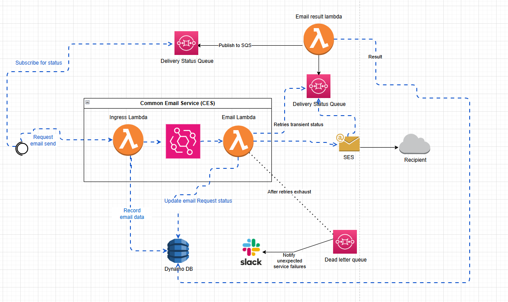

# Event-Driven Monitoring & DevOps Automation

### _AWS CDK + GitHub Actions + Shift-Left Observability_

---

<!-- _class: invert -->

## System Architecture Overview

### Key Components

- **API Gateway** - HTTP endpoint for email requests
- **Processing Lambda** - Validates and queues emails
- **DynamoDB** - Stores email status and metadata
- **EventBridge** - Decouples processing from delivery
- **SES** - Handles actual email transmission
- **SQS + DLQ** - Reliable delivery with error handling

---

<!-- _class: invert smaller -->

## 📡 Monitoring & Observability

| **Component** | **What to Monitor**        | **Failure Indicators**          | **Detection / Metric**                                     | **Alert Trigger**                  | **Resolution**                                       |
| ------------- | -------------------------- | ------------------------------- | ---------------------------------------------------------- | ---------------------------------- | ---------------------------------------------------- |
| API / Lambda  | Request failures / latency | 5XX, throttles, errors          | CloudWatch `Errors`, `Throttles`, `Latency` (p95)          | >1% 5XX in 5m or >3 errors         | Inspect logs; rollback/fix config; raise concurrency |
| EventBridge   | Delivery to targets        | `FailedInvocations`             | CloudWatch metric `FailedInvocations`; DLQ depth           | >0 failures or DLQ >0              | Fix target IAM/endpoint; redrive DLQ                 |
| Email Lambda  | Send processing            | SES API errors, timeouts        | Lambda `Errors`, `Duration`; custom `emailSendFailures`    | >0 errors                          | Tune retries; handle throttling; fix code            |
| SES           | Reputation / quota         | Bounce↑, Complaint↑, Throttled  | SES `Reputation.BounceRate`, `ComplaintRate`, `Reject`     | >2% / >0.1% or Throttled>0         | Clean list; slow rate; request quota                 |
| DynamoDB      | Persistence & status       | Throttled writes; stuck PENDING | `ThrottledRequests`; custom “pending_age”                  | Throttled>0 or pending>N for X min | On-demand/RCU+; reprocess stale                      |
| SQS (Status)  | Backlog & failures         | Visible↑; DLQ↑; oldest age↑     | `ApproximateNumberOfMessagesVisible`, `AgeOfOldestMessage` | Visible>100 or DLQ>0               | Scale consumers; redrive DLQ                         |

---

<!-- _class: invert smaller -->

## 📈 Success Metrics

| **KPI**             | **Definition**                    | **Purpose**           | **Target** |
| ------------------- | --------------------------------- | --------------------- | ---------- |
| Email Success Rate  | `(sent / total) × 100`            | Overall reliability   | ≥ 98%      |
| Avg Processing Time | `sentTime − requestTime`          | E2E performance       | < 5 s      |
| Bounce Rate         | SES metric                        | Deliverability health | < 2%       |
| Complaint Rate      | SES metric                        | User experience       | < 0.1%     |
| Pending Requests    | `count(status='PENDING') / total` | Flow health           | < 2%       |
| DLQ Messages        | DLQ depth                         | Reliability           | 0          |

---

<!-- _class: invert -->

## 🧩 Dev & Deploy of Monitoring (AWS CDK + GitHub Actions)

- Define **CloudWatch alarms, dashboards, log metrics, SNS topics** in **CDK** (IaC).
- Ship them via **GitHub Actions** to every env (preview → deploy → verify).
- Observability changes are **version-controlled**, reviewed, and promoted like app code.
- Engineers own **dashboards + alarms** from day one (shift-left).

  <a href="./code/cdk-monitoring.html" style="padding:10px 16px;border:1px solid #58a6ff;border-radius:8px;text-decoration:none;color:#58a6ff;background:rgba(88,166,255,0.1);">View CDK code</a>
  &nbsp;&nbsp;
  <a href="./code/gha-monitoring.html" style="padding:10px 16px;border:1px solid #58a6ff;border-radius:8px;text-decoration:none;color:#58a6ff;background:rgba(88,166,255,0.1);">View GitHub Actions workflow</a>

---

<!-- _class: invert smaller -->

<h2 style="font-size: 2.8rem !important; margin-bottom: 1.2rem !important;">🔧 Triaging Failures & Implementing Fixes</h2>

<h3 style="font-size: 2.5em !important; margin-bottom: 0.3em !important; color: #58a6ff;"><strong>Scenario 1</strong>: SES Email delivery drops</h3>

| **Step**       | **Action**       | **Tool/Metric**          | **Finding**           |
| -------------- | ---------------- | ------------------------ | --------------------- |
| **Detect**     | CloudWatch alarm | `EmailSuccessRate < 95%` | Alert at 2:15 AM      |
| **Triage**     | Check SES stats  | SES Console              | Bounce: 8% (vs <2%)   |
| **Root Cause** | Review batches   | DynamoDB logs            | Bad campaign data     |
| **Fix**        | Add validation   | Lambda code              | Block invalid domains |
| **Monitor**    | Track recovery   | CloudWatch               | Success back to 98%   |

<h4 style="font-size: 1.8em !important; margin: 0.5em 0 0.2em 0 !important; color: #58a6ff;"><strong>Key Lessons</strong></h4>
<ul style="margin: 0; padding-left: 1em; line-height: 1.2;">
<li>Proactive monitoring prevents complaints</li>
<li>Quick response protects SES reputation</li>
<li>Upstream validation stops bad data</li>
</ul>

<h3 style="font-size: 2.5em !important; margin-bottom: 0.3em !important; color: #58a6ff;"><strong>Scenario 2</strong>: DynamoDB throttling spike</h3>

| **Step**       | **Action**        | **Tool/Metric**    | **Finding**           |
| -------------- | ----------------- | ------------------ | --------------------- |
| **Detect**     | CloudWatch alarm  | `Duration > 500ms` | P95 spike at 3:30 PM  |
| **Triage**     | Check DB metrics  | DynamoDB Console   | `Throttled` = 15/min  |
| **Root Cause** | Traffic analysis  | API Gateway logs   | Campaign launch surge |
| **Fix**        | On-Demand billing | DynamoDB mode      | Instant relief        |
| **Monitor**    | Latency check     | CloudWatch         | P95 back to <200ms    |

<h4 style="font-size: 1.8em !important; margin: 0.5em 0 0.2em 0 !important; color: #58a6ff;"><strong>Key Lessons</strong></h4>
<ul style="margin: 0; padding-left: 1em; line-height: 1.2;">
<li>Auto-scaling prevents degradation</li>
<li>On-Demand handles traffic spikes</li>
<li>Plan capacity for known events</li>
</ul>

<h3 style="font-size: 2.5em !important; margin-bottom: 0.3em !important; color: #58a6ff;"><strong>Scenario 3</strong>: EventBridge delivery failures</h3>

| **Step**       | **Action**       | **Tool/Metric**     | **Finding**            |
| -------------- | ---------------- | ------------------- | ---------------------- |
| **Detect**     | DLQ alarm        | `DLQ Messages > 0`  | 50+ failed events      |
| **Triage**     | Check targets    | EventBridge Console | Lambda target offline  |
| **Root Cause** | Review deploy    | GitHub Actions      | Bad deployment rollout |
| **Fix**        | Rollback version | CDK deploy          | Restore working Lambda |
| **Monitor**    | Redrive DLQ      | SQS Console         | All messages processed |

<h4 style="font-size: 1.8em !important; margin: 0.5em 0 0.2em 0 !important; color: #58a6ff;"><strong>Key Lessons</strong></h4>
<ul style="margin: 0; padding-left: 1em; line-height: 1.2;">
<li>DLQ catches delivery failures</li>
<li>Quick rollback saves the day</li>
<li>Test deployments thoroughly</li>
</ul>

<h3 style="font-size: 2.5em !important; margin-bottom: 0.3em !important; color: #58a6ff;"><strong>Scenario 4</strong>: API Gateway 500 errors</h3>

| **Step**       | **Action**        | **Tool/Metric**   | **Finding**          |
| -------------- | ----------------- | ----------------- | -------------------- |
| **Detect**     | Error rate alarm  | `5XX > 1%`        | 15% error rate       |
| **Triage**     | Check Lambda logs | CloudWatch Logs   | Memory exhaustion    |
| **Root Cause** | Memory analysis   | Lambda metrics    | Large payloads issue |
| **Fix**        | Increase memory   | CDK config update | 512MB → 1024MB       |
| **Monitor**    | Error recovery    | API Gateway       | Errors back to <0.1% |

<h4 style="font-size: 1.8em !important; margin: 0.5em 0 0.2em 0 !important; color: #58a6ff;"><strong>Key Lessons</strong></h4>
<ul style="margin: 0; padding-left: 1em; line-height: 1.2;">
<li>Memory limits cause failures</li>
<li>Right-size Lambda resources</li>
<li>Monitor payload patterns</li>
</ul>

---

<!-- _class: invert -->

## 🏗️ Supporting Design, Release & Operations

### **🎨 Design Phase**

- **Architecture reviews** with observability patterns
- **SLO/SLI definition** early in requirements
- **Error handling strategy** for event-driven flows
- **Capacity planning** based on traffic estimates
- **Security by design** - IAM, encryption, VPC
- **Multi-region failover** considerations

### **🚀 Release Phase**

- **Blue-green deployments** with health checks
- **Canary releases** with automatic rollback
- **Feature flags** for gradual rollouts
- **Database migrations** with zero downtime
- **CDK drift detection** and remediation
- **End-to-end testing** in production-like env

### **⚙️ Operations Phase**

- **24/7 monitoring** with on-call rotation
- **Incident response** playbooks and runbooks
- **Root cause analysis** and post-mortems
- **Performance optimization** based on metrics
- **Cost optimization** through right-sizing
- **Compliance auditing** and security scanning

### **🔄 Continuous Improvement**

- **Retrospectives** after incidents and releases
- **Automation opportunities** identification
- **Metric-driven decisions** for system evolution
- **Team knowledge sharing** and documentation
- **Tool evaluation** and technology adoption
- **Cross-team collaboration** and best practices

